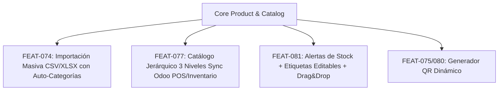
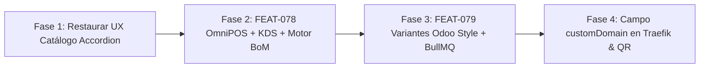

# 🛡️ Plan de Evaluación y Hoja de Ruta: Subdominios Traefik, Integración QR Generator y Evolución de Inventario/Catálogo

> **Documento Estratégico de Arquitectura & Plan de Ejecución**  
> **Fecha:** 2026-08-22  
> **Versión Core:** `v1.20.16`  
> **Estado:** Aprobado / En Planificación  

---

## 1. 🌐 Sistema de Mapeo Administrado por Traefik y su Instancia en OmniFlow

### 1.1 Estándar Unificado de Subdominio por Tenant
* **Formato Único Obligatorio:** `https://<tenant.subdomain>.<ROOT_DOMAIN>` (ej: `https://dimora.pesallaccia.com`).
* **Enrutamiento por Path:** Todos los módulos públicos se sirven bajo paths en ese mismo subdominio (`/social-catalog`, `/bio/:slug`, `/tienda`, `/checkout`). Queda strictly prohibida la creación de subdominios por servicio o categoría.

### 1.2 Traefik v3.4 como Gateway Único
* Reemplazó totalmente a Nginx. Opera con proveedor dinámico por archivos `file` (`/srv/traefik/dynamic/` en prod).
* Emisión SSL automatizada con Let's Encrypt mediante el desafío DNS-01 de Cloudflare.
* Los 6 microservicios standalone (`giveaways`, `omni-catalog`, `omni-bio`, `omni-bookings`, `quotations`, `loyalty`) se exponen bajo el subdominio del tenant sin generar registros DNS independientes.

### 1.3 Caso de Dominio Propio (ej. Provecchio)
* Servidores con su propia marca (como `provecchio.com`) ejecutan una instancia aislada de Traefik en `/srv/traefik/` apuntando directamente a su raíz.

---

## 2. 📱 Integración con el Módulo `qr-generator` (FEAT-075, FEAT-080)

### 2.1 Generación Dinámica e Historial
* `QrController` (`/api/v1/qr/generate`) expone la generación en tiempo real (PNG/SVG) con customización de colores, tamaño y logo embebido.

### 2.2 Descubrimiento Automático de Targets (`/api/v1/qr/targets`)
* El endpoint lee automáticamente los objetivos disponibles del tenant: Productos, Bio-Link (`/bio/:slug`), Catálogo Social (`/social-catalog`) y archivos.

### 2.3 Fix de Resolución Base de URLs (FEAT-080)
* Se eliminó cualquier dominio hardcodeado. El QR construye la URL usando dinámicamente el `req.get('host')` (o `subdomain.ROOT_DOMAIN` / `customDomain`). De este modo, los QRs generados en `provecchio.com` apuntan a `https://provecchio.com/social-catalog` de forma transparente.

---

## 3. 📦 Estado Actual: Avance en Inventario y Productos

1. **Catálogo Jerárquico de 3 Niveles (FEAT-077):** `ProductCategory` extendido con `parentId`, `level` y `order`, integrado bidireccional de Odoo (`pos.category` e inventario `product.category`).
2. **Importación Masiva (FEAT-074):** Carga masiva con parsing CSV/Excel, descarga de plantillas XLSX y modal reutilizable en el panel admin.
3. **Alertas de Inventario y Etiquetas Editables (FEAT-081):** Helper `getStockStatus()` (`AGOTADO`, `Pocas unidades`, `Última unidad`), etiquetas dinámicas reutilizables por tenant sin alterar schema y ordenamiento manual drag & drop.

---

## 4. 🎯 Hoja de Ruta Prioritaria en 4 Fases

### 🚀 Fase 1: Restauración de UX en Catálogo Social (Inmediato)
* Activar el modo `categoryLayoutMode = 'accordion'` por defecto en `social-catalog.tsx` con todas las categorías colapsadas al cargar (`defaultActiveKey={[]}`).
* Restaurar la estética de cápsulas/tarjetas redondeadas de categoría con su badge de conteo (`X productos`) y flecha chevron `>`, devolviendo la practicidad táctil original.

### 🍳 Fase 2: FEAT-078 — OmniPOS, KDS Nativo & Motor BoM Atómico (`v1.21.0`)
* **Motor BoM (Live Escandallo Engine):** Deducción de insumos en tiempo real al cobrar una venta, considerando modificadores (`qtyDelta`), factor de merma (`wastePercentage`) y congelando `costAtSale` para reporte de margen en OmniBI.
* **KDS WebSockets:** Latencia <50ms con semáforo SLA de tiempos de preparación por cocina.

### 🏷️ Fase 3: FEAT-079 — Sistema de Productos con Variantes e Importación (`v1.22.0`)
* Estándar Odoo: `product.template` (producto base) ↔ `product.product` (variante concreta).
* Matriz cartesiana de atributos (Talle, Color, Material) con diferencial de precio (`priceDelta`).
* Queue de importación masiva asíncrona en segundo plano con **BullMQ** (con dry-run y transaccionalidad).

### 🌐 Fase 4: Soporte Nativo de Dominios Propios (`customDomain`)
* Incorporar el campo `customDomain` en `Tenant`, permitiendo que Traefik, `CloudflareDnsService` y el generador QR resuelvan indistintamente subdominios compartidos (`tenant.pesallaccia.com`) o dominios corporativos (`provecchio.com`).
