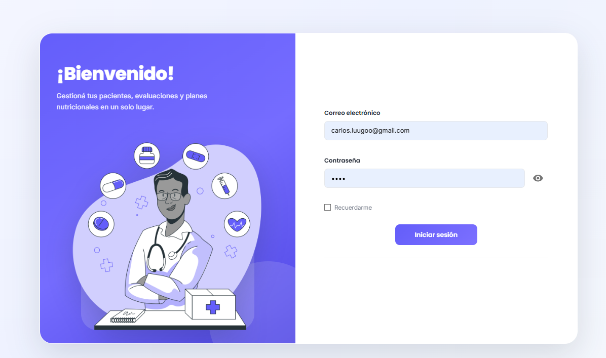
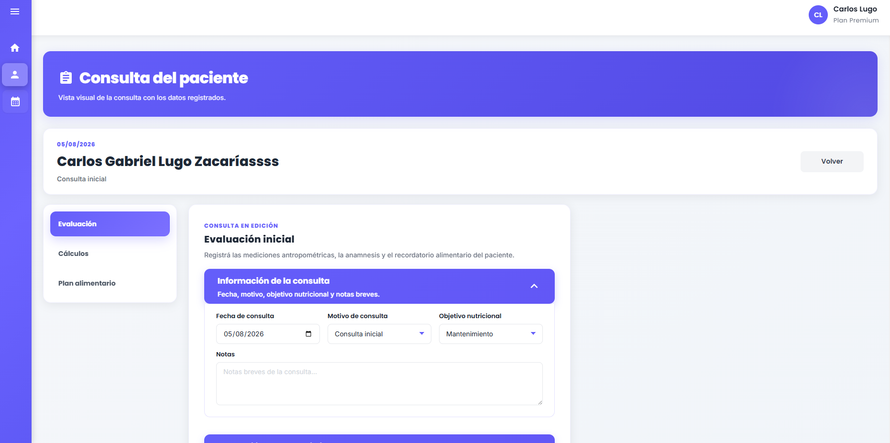
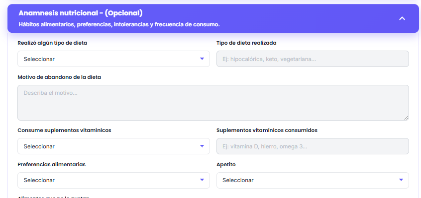
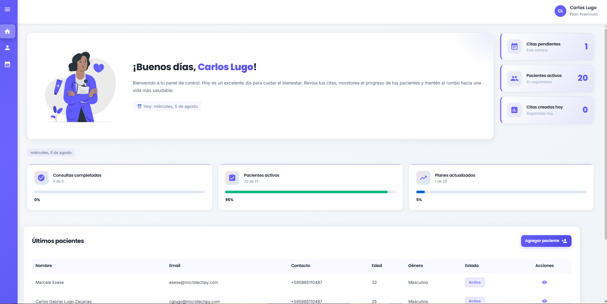
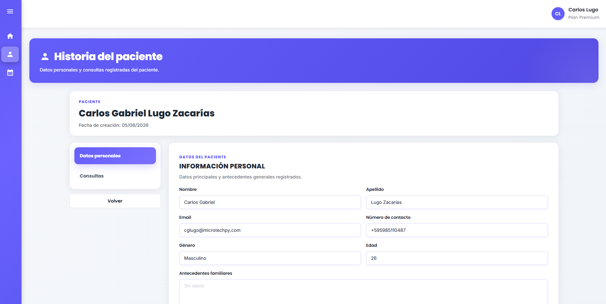
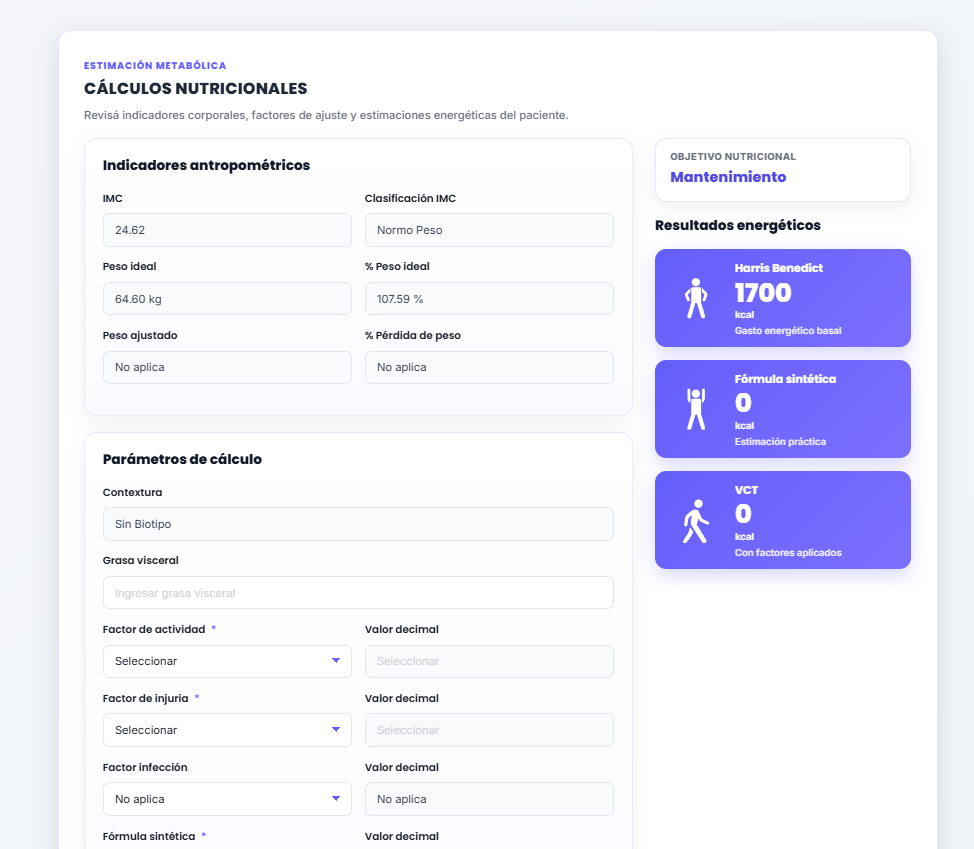
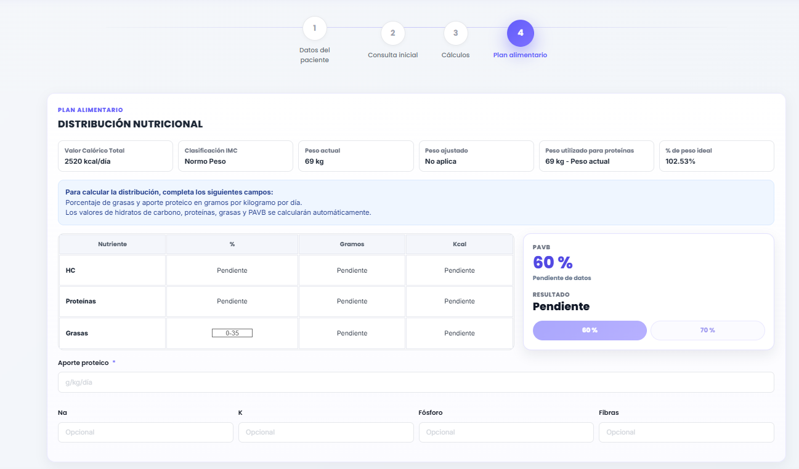
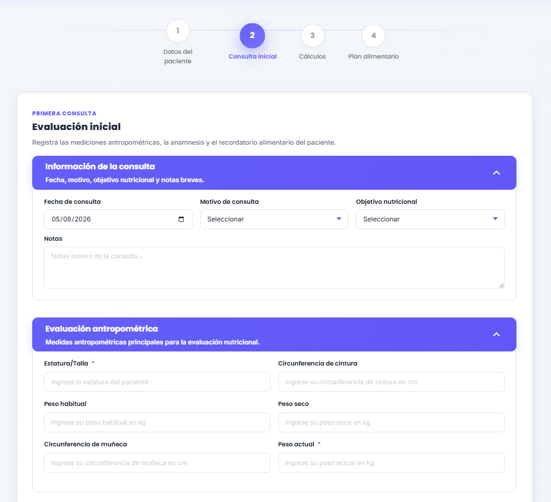
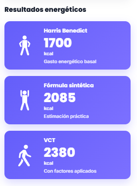

# Manual de Usuario Completo: Vertical NutriLog 🥗

Bienvenido al manual paso a paso de la vertical **NutriLog** de **VitaLog**. Este documento guía a **Profesionales (Nutricionistas/Dietistas)** y **Pacientes** a través de cada caso de uso en la plataforma.

---

## 👨‍⚕️ SECCIÓN 1: MANUAL PARA EL PROFESIONAL NUTRICIONISTA

### 📋 Caso de Uso 1.1: Inicio de Sesión y Dashboard Principal
1. Ingresa a `https://vitalog.pesallaccia.com/login`.
2. Introduce tu email y contraseña de profesional.
3. Al acceder, serás recibido por el **Dashboard de Control Nutricional**, donde podrás ver tus citas agendadas, expedientes activos y alertas de pacientes.

---

### 👤 Caso de Uso 1.2: Alta de Paciente y Datos Personales (Paso 1)
1. Haz clic en el botón **+ Nuevo Paciente** o **Agregar Paciente**.
2. Completa los datos personales básicos:
   - Nombre y Apellido.
   - Fecha de nacimiento (el sistema calculará automáticamente la edad).
   - Teléfono / WhatsApp de contacto.
   - Ocupación y Estilo de Vida.
3. Presiona **Guardar y Continuar**.

---

### 📝 Caso de Uso 1.3: Carga de Anamnesis y Evaluación Antropométrica (Paso 2)
Al avanzar al Paso 2, verás paneles desplegables (acordeones):

1. **Información de la Consulta**: Registra el motivo principal de la consulta y síntomas reportados.
2. **Evaluación Antropométrica ISAK**:
   - Ingrasa la Talla (cm) y el Peso Actual (kg).
   - Registra los pliegues cutáneos en milímetros (mm): **Tricipital, Subescapular, Suprailíaco, Abdominal**.
   - El sistema calculará automáticamente el IMC y el % de Grasa Corporal (Fórmula Durnin-Womersley).

3. **Anamnesis Nutricional & Recordatorio 24h**:
   - Registra alimentos consumidos en las últimas 24 horas desglosados en Desayuno, Almuerzo, Merienda y Cena.

---

### 🧮 Caso de Uso 1.4: Motor de Cálculos Energéticos y Requerimientos (Paso 3)
1. En el Paso 3, el sistema desplegará automáticamente la **Tasa Metabólica Basal (TMB - Mifflin-St Jeor)**.
2. Selecciona los factores de ajuste:
   - **Factor de Actividad**: Reposo (1.2), Ligero (1.375), Moderado (1.55), Intenso (1.725).
   - **Factor de Injuria**: Cirugía menor, Traumatismo, Sepsis.
3. Elige el **Objetivo Nutricional**: Déficit Calórico (-20%), Superávit (+15%) o Mantenimiento.
4. El sistema actualizará en tiempo real el **Valor Calórico Total (VCT)** requerido.

---

### 🍎 Caso de Uso 1.5: Planificador de Dietas y Distribución Nutricional (Paso 4)
1. Asigna el aporte proteico en gramos por kilo (g/kg) y el % de grasas.
2. Verifica la barra de **Proteínas de Alto Valor Biológico (% PAVB)**.
3. Selecciona los alimentos del catálogo base para armar la pauta semanal.
4. Haz clic en **Finalizar y Guardar Plan**.

---

## 📱 SECCIÓN 2: MANUAL PARA EL PACIENTE

### 🔗 Caso de Uso 2.1: Agendamiento desde la PWA "Bio Profesional"
1. Abre el enlace público del nutricionista (`https://vitalog.pesallaccia.com/bio/tu-nutricionista`).
2. Selecciona el servicio **"Consulta Nutricional & Antropometría"**.
3. Ingresa tu Nombre, Teléfono y Fecha preferida.
4. Presiona **Confirmar Solicitud de Cita**.

---

### 📱 Caso de Uso 2.2: Consulta de la Ficha Resumida Móvil
1. Abre tu App Móvil o PWA VitaLog en tu smartphone.
2. En la pantalla principal verás tu **Ficha Resumida NutriLog**:
   - Meta de Calorías Diarias y Meta de Agua (Litros).
   - Menú del día organizado (Desayuno, Almuerzo, Merienda, Cena).
   - Recomendaciones clave de hábitos alimentarios.

